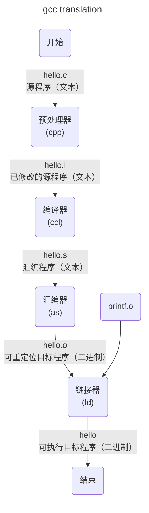

# 二、c++ 概览：基础知识
> All problems in computer science can   
> be solved by another level of indirection,  
> except for the problem of too many layers of indirection.   
> – David J. Wheeler

## 2.1 基本概念

C++ 是一种编译型语言，




- 预处理阶段。预处理器（C Preprocessor, cpp）处理源代码中的预处理指令，如 `#include` 、 `#define` 等，并进行宏替换、条件编译等操作。例如，将系统头文件stdio. H插入到程序文本中，如果程序中存在注释，则删除注释。
```bash
gcc -E hello.c -o hello.i # -E 告诉gcc仅预处理，-o 输出文件名
```
- 编译阶段。编译器（C Compiler, ccl）将高级语言翻译为通用的汇编语言。
```bash
gcc -S hello.i -o hello.s # -S 告诉gcc只进行编译部分
```
- 汇编阶段。汇编器（Assembler, as）将汇编语言翻译为机器指令，这些指令打包为**可重定向目标程序**（relocatable object program）格式。
```bash
gcc -c hello.s -o hello.o # -c 告诉gcc只进行汇编部分
```
- 链接阶段。链接器（Link Editor, ld）将多个目标文件和库文件链接在一起，生成可执行文件或者共享库。由于我们使用了printf函数，它是C编译器提供的标准C库中的一个函数。Printf函数存在于一个名为printf. O的单独的预编译好了的目标文件中，所以需要以某种方式合并到我们的hello. O程序中。
```bash
gcc hello.o -o hello
```
最后得到的hello文件就是目标文件，通过加载到内存中，由系统执行。得到
```bash
hello, world
```

同时，C++也是一种静态类型语言，这意味着编译器在处理任何实体（如对象、值、名称和表达式）时，都必须清楚它的类型。对象的类型决定了能在该对象上执行哪些操作。

### 2.1.1 Hello World!

```c++
int main(){} //最小的C++程序
```
花括号`{}`表示成组，指示出函数体的首尾位置。

```c++
#include <iostream>
int main(){
	std::cout<<"Hello, World!\n";
}
```
`#include`将涉及标准流I/O功能的声明包含（include）进来。运算符`<<`将它的第2个参数写入到第1个参数。字符串字面值是指一对双引号当中的字符序列。

```c++
#include <iostream>
using namespace std; // 指定名字cout所在的标准库命名空间

double square(double x){ // 计算一个双精度浮点数的平方
	return x*x;
}

void print_square(double x){
	cout<<"the square of" << x << "is" << square(x) << "\n";
}

int main(){
	print_square(1.234); // 1.52276
}
```

### 2.1.2 类型、变量和算术运算

- 声明（declaration）一条语句，负责为程序引入一个新名字，并指定该命名实体的类型。
- 类型（type）定义一组可能的值以及一组（对象上的）操作。
- 值（value）一组二进制位，具体含义有其类型决定。
- 变量（variable）一个命名的对象。

初始化器列表`{}`形式可以确保不会发生某些可能导致信息丢失的类型转换：
```c++
int i1=7.2; // 窄化类型转换
int i2{7.2} // 错误：试图执行浮点数向整数的转换
int i3={7.2} // 错误
```

可以使用`=`的初始化形式与`auto`配合，因为在此过程中不存在可能引发错误的类型转换。`auto`可以帮助我们避免冗余，并且无需再书写类型名，这一点在泛型编程中尤其重要。

### 2.1.3 常量

两种不变概念：
- `const`：不改变这个值。主要用于说明接口，这样变量传入函数时不必担心变量会在函数内被改变。
- `constexpr`：在编译时求值。主要用于说明常量，允许数据置于只读内存中以及提升性能。

如果常量表达式（const expression）中存在函数，则该函数必须定义成`constexpr`。

```c++
constexpr double square(double x){return x*x;}
```

`constexpr`函数允许接受非常量实参，但是其结果将不是一个常量表达式。这意味着，我们可以不用将同一个函数定义两次。

### 2.1.4 检验与循环

```c++
bool accept(){
	int tries = 1;
	while(tries<4){
		cout<<"Do you want to proceed(y or n)?\n";
		char answer = 0;
		cin >> answer;
		
		switch(answer){
			case 'y':
				return true;
			case 'n':
				return false;
			default:
				cout<<"Sorry, I don't understand that.\n";
				++tries;
		}
	}
	cout<<"I'll take that for a no.\n";
	return false;
}
```

### 2.1.5 指针、数组和循环

范围for语言（range-based for loop）：
```c++
void print(){
    int v[]={1,2,3,4,5};
    
    for(auto x:v){
        cout<<x<<"\n";
    }
    
    for(auto x: {1,2,3,4,5}){
        cout<<x<<"\n";
    }
    
    for(auto& x:v){
        ++x;    // 数组v中每个元素自增1
    }
}
```

运算符（`&`、`*`、`[]`）称为*声明运算符*（declarator operators）：
```c++
T a[n];     // n个T组成的数组
T* p;       // 指向T的指针
T& r;       // T的引用
T f(A);     // 接受A类型实参，返回T类型结果的函数
```

被所有指针类型共享的同一个空指针（nullptr）：
```c++
double* pd=nullptr; // 正确
int x=nullptr;      // 错误：nullptr是个指针，不是整数
```
使用nullptr避免在整数（0和NULL）和指针（如nullptr）之间发生混淆。

## 2.2 用户自定义类型

通过基本类型、const修饰符和声明运算符构造出的类型称为*内置类型*（build-in type）。

C++抽象机制（abstraction mechanism）目的主要于让程序员能够设计并实现他们自己的数据类型，这些类型具有恰当的表现形式和操作，程序员可以简单优雅地使用它们。将利用C
++抽象机制构建的新类型称为*用户自定义类型*（user-defined type），诸如类和枚举等。

### 2.2.1 结构

Vector的第一个版本：
```c++
struct Vector{
    int sz;         // 元素数量
    double* elem;   // 指向元素的指针
```

`new`运算符哦才能够一块名为*自由存储*（free store）（又称为*动态内存*（dynamic memory）或*堆*（heap））的区域中分配内存。

> 📢 
> 
> 与其试着重写Vector和String等标准库组件，不如直接将它们拿来使用。

访问成员的方式有两种：一种通过名字或引用，使用点运算符（`.`）；另一种通过指针，使用`->`。
```c++
void f(Vector v, Vector& rv, Vector* pv){
    int i1=v.sz;    // 通过名字访问
    int i2=rv.sz;   // 通过引用访问
    int i3=pv->sz;  // 通过指针访问
}
```

### 2.2.2 类

将类型的接口与其实现分离，这种机制称为*类*（class）。类的public成员定义该类的接口，Private成员则只能通过接口访问。
```c++
clas Vector{
public:
    Vector(int s):elem{new double[s]},sz{s}{}   // 构建一个Vector
    double& operator[](int i){return elem[i];}  // 通过下标访问元素
    int size(){return sz;}
private:
    double* elem;   // 指向元素的指针
    int sz;         // 元素的数量
} 
```
Vector对象是一个“句柄”，它包含指向元素的指针（elem）以及元素的数量（sz）。一个固定大小的句柄指向位于“别处”（即通过new分配的自由指针）的一组可变数量的数据。

与类同名函数称为“*构造函数*”（constructor），用来构造类的对象的函数。构造函数的作用是初始化类的对象，因此定义一个构造函数可以解决类变量未初始化的问题。

### 2.2.3 枚举

```c++
enum class Color{red,blue,green};
enum class Traffic_light{green,yellow,red};

Color col=Color::red;   // 处于Color作用域内的red值
Traffic_light light=Traffic_light::red;
```
枚举类型常用于描述规模较小的整数值集合。通过使用有指代意义的（且易于记忆的）枚举值名字可提高代码的可读性，降低出错的风险。

enum后面的class指明枚举是强类型的，其枚举值位于指定的作用域中。如果不想显式的限定枚举值名字，并且希望枚举值可以是`int`（无须显式转换），则应该去掉`class`得到“普通的”enum。

## 2.3 模块化

C++使用声明（declaration）描述接口，指定了使用某个函数或某种类型所需的所有内容。关键点函数体，即函数的定义（definition）位于“其他某处”。
```c++
double sqrt(double); // 声明

double sqrt(double d){ // sqrt()的定义
    // 求解平方根的算法
}
```

### 2.3.1 分离编译

用户代码只能看到所用类型和函数声明（头文件（header file）），其定义放在分离的源文件里，被分别编译。这种机制有助于：
- 将一个程序组织分成独立的代码片段。
- 编译时间减到最少。
- 强制要求程序中逻辑独立部分分离开，从而将发生错误的几率降到最低。

> 最大限度地模块化，逻辑上通过语言特性描述模块，物理上通过划分文件及高效分离编译来充分利用模块化。

### 2.3.2 命名空间

命名空间（namespace），一方面表达某些声明属于一个整体；另一方面表明它们的名字不会与其他命名空间的名字冲突。

命名空间主要用于组织较大规模的程序组件，最典型的例子是库。使用命名空间，我们既可以很容易地把若干独立开发的部件组织成一个程序。

### 2.3.3 错误处理

> 模块化和抽象机制（特别是库的使用）的一个重要影响就是运行时错误的捕获位置与错误处理的位置被分离开来。

#### 2.3.3.1 异常

常见的越界访问（out-of-range）：
```c++
double& Vector::operator[](int i){
    if(i<0||size()<=i) throw out_of_range{"Vector::operator[]"};
    return elem[i];
}
```
throw负责把程序的控制权从某个直接或间接调用了`Vector::operator[]()`的函数转移到`out_of_range`异常处理代码。为了实现这一目标，实现部分需要占看函数调用栈以便返回主调函数的上下文：
```c++
void f(Vector& v){
    // ...
    try{ // 此处的异常将被后面定义的处理模块处理
        v[v.size()]=7; // 试图访问v末尾之后的位置
    }catch(out_of_range){ // 糟糕！发生了越界错误
        // 在此处处理越界错误
    }
    // ...
}
```
`out_of_range`类型定义在标准库中。

#### 2.3.3.2 不变式

所谓的异常机制本质处于所谓的*前置条件*（precondition）没有满足从而触发错误。对于类来说，对一条假设某事为真的声明称为*类的不变式*（class invariant），简称为*不变式*（invariant）。

建立类的不变式是构造函数的任务（从而成员函数可以依赖于该不变式），同时其也确保当成员函数退出时不变式仍然成立。

例如，为了检验传入的实参是否有效：
```c++
Vector::Vector(int s){
    if(s<0) throw length_error{};
    elem=new double[s]; // 确保可以正确的初始化
    sz=s;
}
```

不变式的概念是设计类的关键，而前置条件也在设计函数的过程中起到同样的作用。不变式
- 帮助我们准确地理解想要什么。
- 强制要求具体而明确地描述设计，而这有助于确保代码正确（在调试和测试之后）。

不变式的概念是C++中有构造函数和析构函数支撑的资源管理概念的基础。

### 2.3.3.3 静态断言

静态断言（static assert），在编译时发生的错误显然要比在运行时发生错误效果更好。通过对一些编译时可知的属性做一些属性（property）做一些简单检查，并以编译器错误消息形式报告所发现的问题。
```c++
static_assert(4<=sizeof(int),"integers are too small"); // 检查整数的尺寸
```
如果前者不满足，则会报出后者消息。`static_assert`机制能用于可以表达为常量表达式的东西。需要注意：前者所含所有变量均为常量。

静态断言最重要的用途是为泛型编程中作为形参的类型设置断言。

## 2.4 建议

- 不必慌张，一切知识都会随着时间推移变得逐渐清晰。
- 即使你没有掌握C++所有细节，也能写出漂亮的程序。
- 请关注编程技术，而非语言特性。

