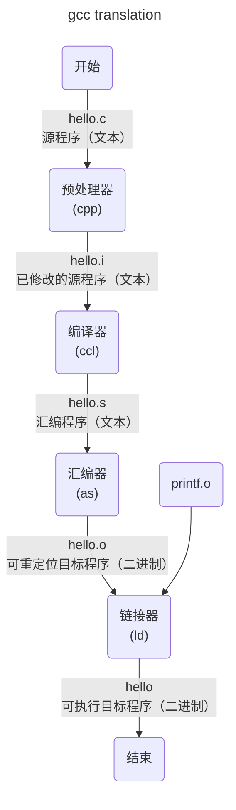

# 二、c++ 概览：基础知识
> All problems in computer science can   
> be solved by another level of indirection,  
> except for the problem of too many layers of indirection.   
> – David J. Wheeler

## 2.1 基本概念

C++ 是一种编译型语言，




- 预处理阶段。预处理器（C Preprocessor, cpp）处理源代码中的预处理指令，如 `#include` 、 `#define` 等，并进行宏替换、条件编译等操作。例如，将系统头文件stdio. H插入到程序文本中，如果程序中存在注释，则删除注释。
```bash
gcc -E hello.c -o hello.i # -E 告诉gcc仅预处理，-o 输出文件名
```
- 编译阶段。编译器（C Compiler, ccl）将高级语言翻译为通用的汇编语言。
```bash
gcc -S hello.i -o hello.s # -S 告诉gcc只进行编译部分
```
- 汇编阶段。汇编器（Assembler, as）将汇编语言翻译为机器指令，这些指令打包为**可重定向目标程序**（relocatable object program）格式。
```bash
gcc -c hello.s -o hello.o # -c 告诉gcc只进行汇编部分
```
- 链接阶段。链接器（Link Editor, ld）将多个目标文件和库文件链接在一起，生成可执行文件或者共享库。由于我们使用了printf函数，它是C编译器提供的标准C库中的一个函数。Printf函数存在于一个名为printf. O的单独的预编译好了的目标文件中，所以需要以某种方式合并到我们的hello. O程序中。
```bash
gcc hello.o -o hello
```
最后得到的hello文件就是目标文件，通过加载到内存中，由系统执行。得到
```bash
hello, world
```

同时，C++也是一种静态类型语言，这意味着编译器在处理任何实体（如对象、值、名称和表达式）时，都必须清楚它的类型。对象的类型决定了能在该对象上执行哪些操作。

### 2.1.1 Hello World!

```c++
int main(){} //最小的C++程序
```
花括号`{}`表示成组，指示出函数体的首尾位置。

```c++
#include <iostream>
int main(){
	std::cout<<"Hello, World!\n";
}
```
`#include`将涉及标准流I/O功能的声明包含（include）进来。运算符`<<`将它的第2个参数写入到第1个参数。字符串字面值是指一对双引号当中的字符序列。

```c++
#include <iostream>
using namespace std; // 指定名字cout所在的标准库命名空间

double square(double x){ // 计算一个双精度浮点数的平方
	return x*x;
}

void print_square(double x){
	cout<<"the square of" << x << "is" << square(x) << "\n";
}

int main(){
	print_square(1.234); // 1.52276
}
```

### 2.1.2 类型、变量和算术运算

- 声明（declaration）一条语句，负责为程序引入一个新名字，并指定该命名实体的类型。
- 类型（type）定义一组可能的值以及一组（对象上的）操作。
- 值（value）一组二进制位，具体含义有其类型决定。
- 变量（variable）一个命名的对象。

初始化器列表`{}`形式可以确保不会发生某些可能导致信息丢失的类型转换：
```c++
int i1=7.2; // 窄化类型转换
int i2{7.2} // 错误：试图执行浮点数向整数的转换
int i3={7.2} // 错误
```

可以使用`=`的初始化形式与`auto`配合，因为在此过程中不存在可能引发错误的类型转换。`auto`可以帮助我们避免冗余，并且无需再书写类型名，这一点在泛型编程中尤其重要。

### 2.1.3 常量

两种不变概念：
- `const`：不改变这个值。主要用于说明接口，这样变量传入函数时不必担心变量会在函数内被改变。
- `constexpr`：在编译时求值。主要用于说明常量，允许数据置于只读内存中以及提升性能。

如果常量表达式（const expression）中存在函数，则该函数必须定义成`constexpr`。

```c++
constexpr double square(double x){return x*x;}
```

`constexpr`函数允许接受非常量实参，但是其结果将不是一个常量表达式。这意味着，我们可以不用将同一个函数定义两次。

### 2.1.4 检验与循环

```c++
bool accept(){
	int tries = 1;
	while(tries<4){
		cout<<"Do you want to proceed(y or n)?\n";
		char answer = 0;
		cin >> answer;
		
		switch(answer){
			case 'y':
				return true;
			case 'n':
				return false;
			default:
				cout<<"Sorry, I don't understand that.\n";
				++tries;
		}
	}
	cout<<"I'll take that for a no.\n";
	return false;
}
```

### 2.1.5 指针、数组和循环

